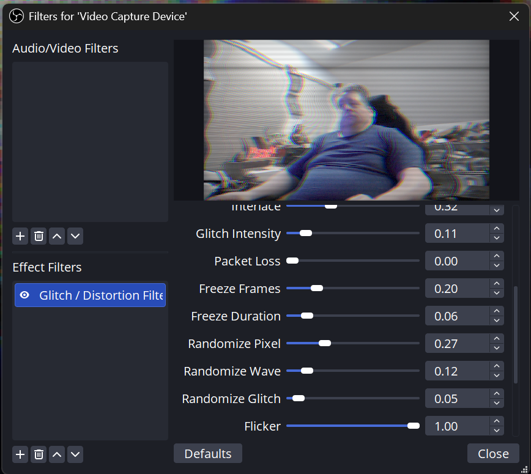
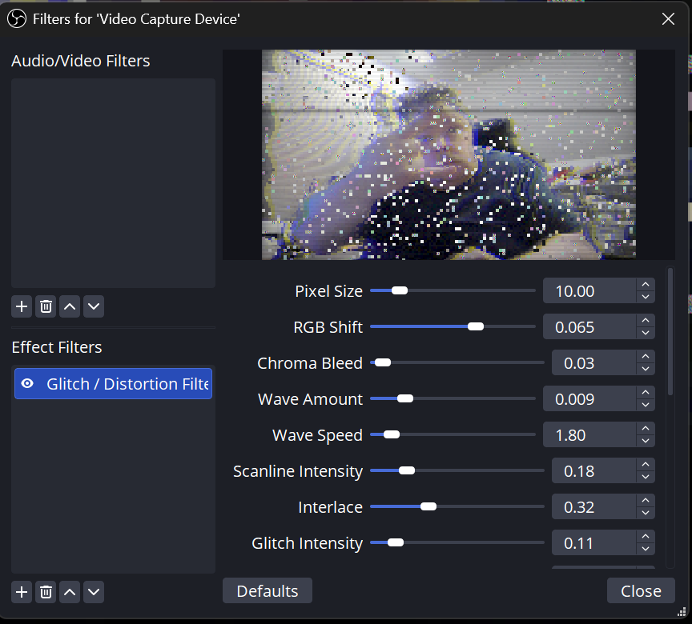
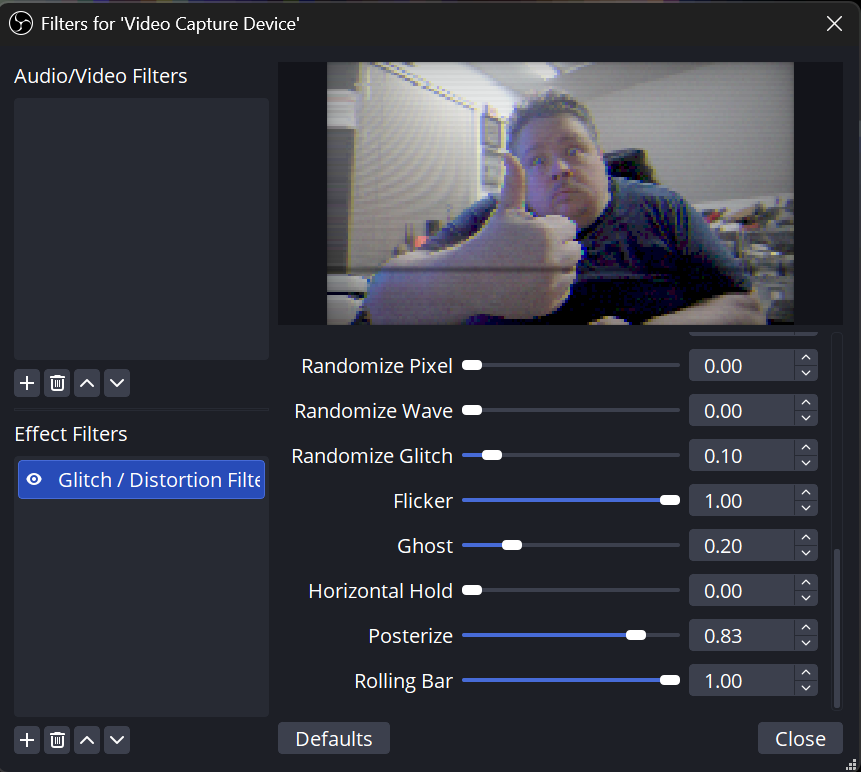
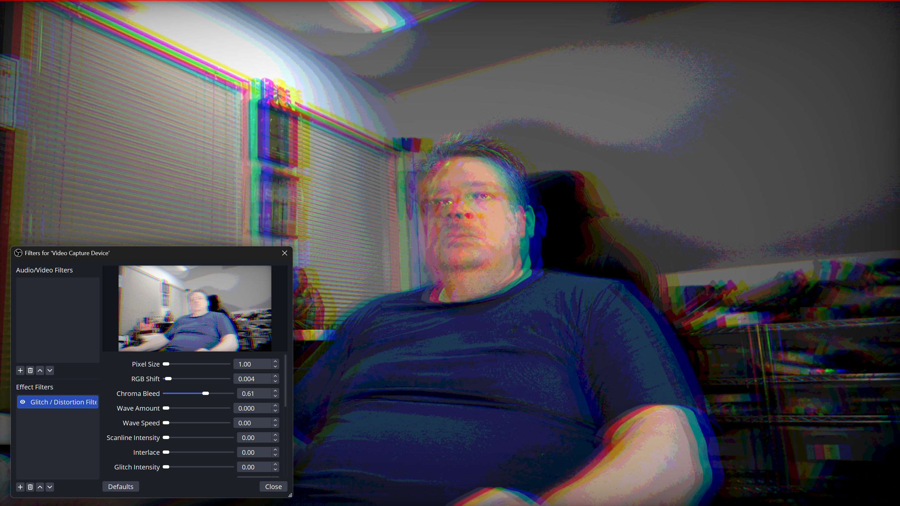

# OBS Glitch / Distortion Filter

A video filter plugin for OBS Studio that applies a distorted, pixelated, glitchy effect to any video source (webcam, screen capture, media source, etc.). Designed to look like a failing camera or bad video transmission — everything still works, but it looks broken.

## Screenshots

| Default Look | Heavy Glitch | Packet Loss + Freeze | Full Chaos |
|---|---|---|---|
|  |  |  |  |

## Support the Project

This plugin is completely free and open source. If you find it useful and want to help keep projects like this coming, a tip is always appreciated but never expected.

[**Leave a Tip**](https://streamelements.com/barnacules/tip) — it genuinely helps fuel late-night coding sessions and keeps the weird plugins flowing.

## Features

| Feature | Description |
|---|---|
| **Pixelation** | Blocky low-res look. Size is adjustable and can be randomized frame-to-frame |
| **RGB Channel Shift** | Chromatic aberration that shifts red/blue channels apart |
| **Chroma Bleed** | Extra color bleeding across edges, like bad video compression |
| **Wave Distortion** | Sine-wave warping across the image with adjustable speed |
| **Scanlines** | Retro CRT-style scanlines |
| **Interlace** | Interlacing artifacts that darken alternate lines |
| **Glitch Blocks** | Random horizontal tearing, color inversion, and digital noise |
| **Packet Loss** | 16x16 macroblock corruption — blocks smear, invert, turn solid color, or fill with noise |
| **Freeze Frames** | Randomly freezes the distortion animation to simulate a stuck decoder |
| **Flicker** | Random brightness pulses like a failing power supply |
| **Ghost** | Faint trailing echo image offset horizontally |
| **Horizontal Hold** | Old TV-style horizontal jitter and instability |
| **Posterize** | Reduced color bit depth for compression banding artifacts |
| **Rolling Bar** | Slow dark interference bar that rolls down the screen |
| **Per-Effect Randomizers** | Make pixel size, wave, and glitch jitter unpredictably instead of repeating smoothly |
| **Vignette** | Darkened edges to focus attention on the center distortion |

## Installation

### Windows

#### Method 1: Automatic Installer (Recommended)

1. Download `obs-distort-filter-windows.zip` from the [latest release](https://github.com/Barnacules/obs-distort-filter/releases)
2. Extract it anywhere
3. Right-click **`INSTALL.ps1`** → **Run with PowerShell**
   - The script auto-detects your OBS installation path
   - If it can't find OBS, it'll ask you to type the path
4. Restart OBS Studio

#### Method 2: Manual Copy

1. Close OBS Studio completely
2. Copy `obs-plugins/64bit/obs-distort-filter.dll` to your OBS `obs-plugins/64bit/` folder
3. Copy `data/obs-plugins/obs-distort-filter/distort_filter.effect` to your OBS `data/obs-plugins/obs-distort-filter/` folder
4. Copy `data/obs-plugins/obs-distort-filter/locale/en-US.ini` to your OBS `data/obs-plugins/obs-distort-filter/locale/` folder
5. Restart OBS Studio

**Default Windows Paths:**
- Standard: `C:\Program Files\obs-studio\`
- Steam: `C:\Program Files (x86)\Steam\steamapps\common\OBS Studio\`
- Portable: wherever you extracted the portable zip

### Linux

#### Method 1: Install Script

1. Download `obs-distort-filter-linux.tar.gz` from the [latest release](https://github.com/Barnacules/obs-distort-filter/releases)
2. Extract it: `tar xzf obs-distort-filter-linux.tar.gz`
3. Run the installer:
   ```bash
   cd obs-distort-filter-linux
   chmod +x INSTALL.sh
   ./INSTALL.sh
   ```
4. Choose user-local (recommended, no sudo) or system-wide installation
5. Restart OBS Studio

#### Method 2: Manual Copy (User-Local)

1. Close OBS Studio
2. Create the plugin directory:
   ```bash
   mkdir -p ~/.config/obs-studio/plugins/obs-distort-filter/bin/64bit
   mkdir -p ~/.config/obs-studio/plugins/obs-distort-filter/data/locale
   ```
3. Copy the files:
   ```bash
   cp obs-distort-filter.so ~/.config/obs-studio/plugins/obs-distort-filter/bin/64bit/
   cp distort_filter.effect ~/.config/obs-studio/plugins/obs-distort-filter/data/
   cp en-US.ini ~/.config/obs-studio/plugins/obs-distort-filter/data/locale/
   ```
4. Restart OBS Studio

#### Method 3: Manual Copy (System-Wide)

1. Close OBS Studio
2. Copy the `.so` to your system OBS plugins directory:
   ```bash
   sudo cp obs-distort-filter.so /usr/lib/obs-plugins/
   # or /usr/lib64/obs-plugins/ on some distros
   ```
3. Copy data files:
   ```bash
   sudo mkdir -p /usr/share/obs/obs-plugins/obs-distort-filter/locale
   sudo cp distort_filter.effect /usr/share/obs/obs-plugins/obs-distort-filter/
   sudo cp en-US.ini /usr/share/obs/obs-plugins/obs-distort-filter/locale/
   ```
4. Restart OBS Studio

**Prerequisites:** `libobs0t64` (or equivalent) must be installed. Most OBS installs include this.

### macOS

1. Download `obs-distort-filter-macos.tar.gz` from the [latest release](https://github.com/Barnacules/obs-distort-filter/releases)
2. Extract it: `tar xzf obs-distort-filter-macos.tar.gz`
3. Copy the plugin bundle to your OBS plugins folder:
   ```bash
   cp -R obs-distort-filter-macos/obs-plugins/obs-distort-filter.plugin \
     ~/Library/Application\ Support/obs-studio/plugins/
   ```
4. Restart OBS Studio

> **Note for macOS users:** macOS binaries are built via GitHub Actions. If the latest release doesn't include a macOS build yet, you can build from source using the instructions below.

## Usage

1. Add a **Video Capture Device** source (your webcam) or any video source
2. Right-click the source → **Filters**
3. Under **Effect Filters**, click the **+** button
4. Select **Glitch / Distortion Filter**
5. Adjust sliders live while watching the preview:

| Slider | Range | Default | What it does |
|---|---|---|---|
| **Pixel Size** | 1–64 | 8 | Blockiness of pixelation. Higher = bigger blocks |
| **RGB Shift** | 0.0–0.1 | 0.02 | How much red/blue channels separate |
| **Chroma Bleed** | 0.0–1.0 | 0.15 | Color bleeding across edges |
| **Wave Amount** | 0.0–0.05 | 0.01 | How warped the image gets |
| **Wave Speed** | 0.0–20.0 | 3.0 | How fast the wave animates |
| **Scanline Intensity** | 0.0–1.0 | 0.3 | Darkness of CRT-style lines |
| **Interlace** | 0.0–1.0 | 0.2 | Darken every other scanline |
| **Glitch Intensity** | 0.0–1.0 | 0.3 | Frequency and strength of random glitches |
| **Packet Loss** | 0.0–1.0 | 0.2 | Macroblock corruption frequency |
| **Freeze Frames** | 0.0–1.0 | 0.15 | How often image freezes (0 = never, 1 = constantly) |
| **Freeze Duration** | 0.0–0.5 | 0.08 | How long each freeze lasts |
| **Randomize Pixel** | 0.0–1.0 | 0.3 | How much pixel size jitters frame-to-frame |
| **Randomize Wave** | 0.0–1.0 | 0.4 | How much wave distortion jitters unpredictably |
| **Randomize Glitch** | 0.0–1.0 | 0.5 | How much glitch intensity bursts randomly |
| **Flicker** | 0.0–1.0 | 0.15 | Random brightness pulses |
| **Ghost** | 0.0–1.0 | 0.1 | Faint trailing echo image |
| **Horizontal Hold** | 0.0–1.0 | 0.1 | Horizontal jitter like an old TV |
| **Posterize** | 0.0–1.0 | 0.0 | Color banding / reduced bit depth |
| **Rolling Bar** | 0.0–1.0 | 0.1 | Slow dark bar rolling down the screen |

## Default Look

The defaults are tuned to give a **"camera is trying to work but failing"** vibe:
- Medium pixelation (8px blocks) with slight randomization
- Subtle RGB shift and chroma bleed
- Slow wave distortion with moderate randomization
- Visible scanlines and interlacing
- Occasional glitch tearing, noise, and packet loss
- Occasional freeze frames and flicker
- Rolling bar and horizontal hold for analog decay feel

## Building from Source

### Prerequisites

- **Visual Studio 2022** with **Desktop development with C++** workload
- **CMake** 3.16+
- **Git**

### Build Steps

1. Clone the OBS Studio source:
   ```powershell
   git clone --recursive https://github.com/obsproject/obs-studio.git
   cd obs-studio
   ```

2. Copy this plugin into the OBS plugins folder:
   ```powershell
   Copy-Item -Recurse ..\obs-distort-filter plugins\obs-distort-filter
   ```

3. Add the plugin to `plugins/CMakeLists.txt`. Find the section that lists plugins and add:
   ```cmake
   add_obs_plugin(obs-distort-filter PLATFORMS WINDOWS)
   ```

4. Create a build directory and configure with CMake:
   ```powershell
   mkdir build && cd build
   cmake .. -A x64 -DENABLE_BROWSER=OFF -DENABLE_UI=OFF -DENABLE_SCRIPTING=OFF -DENABLE_HEVC=OFF -DENABLE_PLUGINS=ON
   ```

5. Build:
   ```powershell
   cmake --build . --config Release --target obs-distort-filter
   ```

6. The output will be at:
   - `build\plugins\obs-distort-filter\Release\obs-distort-filter.dll`
   - `plugins\obs-distort-filter\data\distort_filter.effect`

## File Structure

```
obs-distort-filter/
├── CMakeLists.txt                  # CMake build file
├── README.md                       # This file
├── obs-distort-filter.c            # Main plugin C code
├── cmake/
│   └── windows/
│       └── obs-module.rc.in        # Windows DLL metadata
└── data/
    ├── distort_filter.effect       # GPU shader (HLSL/GLSL)
    └── locale/
        └── en-US.ini               # UI labels
```

## Compatibility

| Platform | Status | Architecture |
|---|---|---|
| Windows 10/11 | Fully supported | x64 |
| Linux (Ubuntu, Debian, Arch, etc.) | Fully supported | x64 |
| macOS | Supported via GitHub Actions CI | x64 / Apple Silicon |

- **OBS Studio**: 29.x, 30.x, 31.x (built with backward ABI compatibility)
- **GPU**: DirectX 11 (Windows), OpenGL (Linux), Metal (macOS) capable
- **Architecture**: 64-bit only

## Troubleshooting

| Problem | Solution |
|---|---|
| **Filter does not appear in the menu** | Make sure the plugin binary (`.dll`/`.so`/`.dylib`) **and** the `.effect` shader file are both present. If either is missing, OBS loads the module but the filter won't register. Restart OBS after installing. |
| **`obs_register_source: size mismatch` error** | This plugin uses `obs_register_source_s(..., 408)` for backward compatibility. If you see a struct size error, you may have an older version of the plugin cached somewhere. Search your entire OBS folder for `obs-distort-filter` and delete all copies, then reinstall. |
| **Black screen when filter is applied** | The shader may have failed to compile. Check `Help → Log Files → View Current Log` (Windows) or launch OBS from terminal and check output (Linux/macOS) for shader compile errors. Make sure `distort_filter.effect` is in the correct data folder. |
| **Performance issues / high GPU usage** | Reduce **Pixel Size**, disable **Scanlines**/**Interlace**, or lower **Freeze Frames** frequency. The effect is GPU-intensive; integrated graphics may struggle at 4K. Try 1080p or lower. |
| **Linux: `error while loading shared libraries: libobs.so`** | Install the OBS runtime libraries: `sudo apt install libobs0t64` (Ubuntu/Debian) or equivalent for your distro. |
| **Linux: plugin not found after installing** | Make sure you used the correct path. User-local install goes to `~/.config/obs-studio/plugins/obs-distort-filter/bin/64bit/obs-distort-filter.so`. Verify with `ls ~/.config/obs-studio/plugins/obs-distort-filter/bin/64bit/`. |
| **macOS: "cannot be opened" security warning** | Right-click OBS → Get Info → check "Override Malware Protection" or go to System Settings → Privacy & Security → allow the plugin. This is normal for unsigned plugins. |

## License

MIT License — do whatever you want with it.

Coded using OpenClaude + Kimi K2.6 on request from co-host during [#TechTalk livestream](youtube.com/barnacules1). If you enjoy this plugin please consider [tipping](https://streamelements.com/barnacules/tip) and include that it's for this plugin in the tip note! No pressure, just glad you're using & enjoying it!
